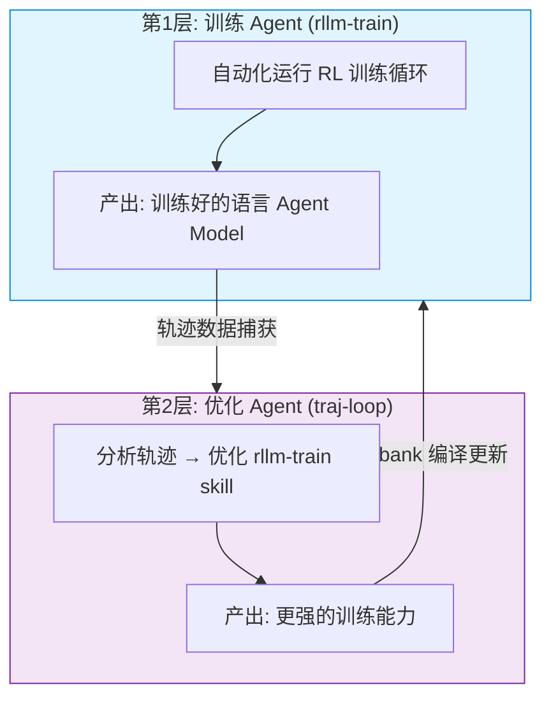
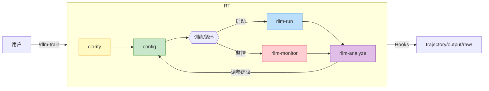
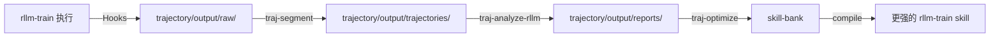

# rllm-trl

将 [rLLM](https://github.com/agentification/rllm) 的 agent/environment 抽象与 HuggingFace [TRL](https://github.com/huggingface/trl) 的 GRPOTrainer 结合，在 Mac 上用强化学习训练语言 agent。

## 核心理念：模型自己训练自己

本项目实现了**双层 Agent 自演进架构**，让语言 agent 和训练它的 skill 系统互相驱动、持续进化：



**核心创新**:
- **训练闭环**: rllm-train skill 自动驱动 RL 训练流程，自动捕获训练轨迹
- **优化闭环**: traj-loop skill 基于轨迹数据自动分析、自动生成 skill 优化补丁，形成自进化循环
- **双重自动**: 训练自动执行，优化自动进行，模型和训练系统同步持续演进

## 快速开始

```bash
pip install torch transformers trl datasets

# 默认配置（claude2.5-0.5B，64 道题，2 个 epoch）
python -m rllm_trl.train

# 自然语言配置（支持中英文）
python -m rllm_trl.train "用 claude-0.5b 训练数学 agent，64 个问题，2 个 epoch"
python -m rllm_trl.train "quick test with 16 problems"

# 从配置文件启动（由 rllm-config skill 生成）
python -m rllm_trl.run_training rllm_trl/output/runs/<run_id>/config.json
```

## 双层 Agent 自演进系统

### 第一层：训练 Agent — rllm-train

驱动完整 RL 训练闭环的 Claude Code skill 系统：



**Skill 一览**:

| Skill | 职责 |
|---|---|
| `rllm-train` | 主编排，串联全流程，支持 auto/approve 两种执行模式 |
| `rllm-clarify` | 从自然语言中提取结构化训练需求（中英文） |
| `rllm-config` | 生成初始配置 / 根据分析结果自动调参 |
| `rllm-run` | 后台启动训练进程 |
| `rllm-monitor` | 实时监控训练进度，检测异常（loss 爆炸、OOM、进程崩溃） |
| `rllm-analyze` | 分析训练结果，生成调参建议（含决策树） |

**三种使用模式**:

| 模式 | 适用场景 | 命令示例 |
|------|---------|---------|
| 手动 | 单次训练，按步确认 | `/rllm-train approve 模式，claude-0.5b，64 题` |
| 自动 | 快速测试，持续调参重训 | `/rllm-train auto 模式，16 题，reward >= 0.5` |
| 优化 | 多轮自动优化 skill | `/traj-loop 用 claude-0.5b 自动优化 3 轮` |

### 第二层：优化 Agent — traj-loop

基于轨迹捕获和 LLM 分析的自动化 skill 优化系统。它不直接训练模型，而是通过分析 rllm-train 执行轨迹来优化 rllm-train 本身：



**为什么需要两层隔离？**

优化 agent（traj-loop）和训练 agent（rllm-train）必须保持观察者/被观察者的严格隔离：
- traj-loop 通过 Claude Code Agent 工具在独立子 agent 中执行，拥有全新对话上下文，物理上无法看到训练过程细节
- 训练数据只能通过 trajectory/output/ 文件系统传递，不经过对话上下文
- 这确保了优化建议基于客观轨迹数据，而非训练过程的内部状态

**Skill 一览**:

| Skill | 职责 |
|---|---|
| `traj-loop` | 顶层编排：自动执行 N 轮「训练→分割→分析→优化」循环 |
| `traj-segment` | 将原始事件流分割为结构化轨迹 |
| `traj-analyze-rllm` | LLM 分析训练轨迹，识别问题模式，生成优化建议 |
| `traj-optimize` | 将分析报告转化为 skill-bank patch，人工确认后编译 |

**优化模式**:

| 模式 | 说明 | 命令示例 |
|------|------|---------|
| 半自动 | /traj-loop 执行训练和分析，展示 patch 等待确认 | `/traj-loop claude-0.5b，3 轮，approve` |
| 全自动 | /traj-loop 连续执行训练、分析、优化，用户只接收最终报告 | `/traj-loop claude-0.5b，3 轮，auto` |

### 自演进流程示例

```
Round 1: 用户发起 /traj-loop
  rllm-train 执行 → 轨迹捕获 → 分析发现问题: lr 过高导致崩溃
  → 生成 patch: rllm-config lr 1e-5 → 5e-6

Round 2: 使用优化后的 rllm-train
  训练稳定 → 发现新问题: num_problems 不足导致过拟合
  → 生成 patch: rllm-config problems 64 → 128

Round 3: 继续优化
  reward 持续上升 → 格式退化问题
  → 生成 patch: rllm-analyze 调整 loss_type

最终: 3 轮优化后，reward 从 0.25 → 0.65，skill 持续自我改进
```

## 训练管线工作原理

```
train.py → GRPOTrainer → rollout_func → HFAgentExecutionEngine → agent/env 循环
```

每个训练步骤：
1. GRPOTrainer 调用自定义 rollout 函数
2. `HFAgentExecutionEngine` 用 `model.generate()` 运行 agent-environment 循环
3. `ToolAgent` 解析工具调用，`MathCalcEnv` 执行并返回观测
4. 逐 token 响应掩码（1=模型，0=环境）确保只有模型 token 参与梯度更新
5. 轨迹、奖励、掩码回传给 GRPOTrainer 进行策略更新

## 模块结构

| 模块 | 职责 |
|---|---|
| `train.py` | 入口，构建数据集、模型、tokenizer，接入 GRPOTrainer |
| `config.py` | `TrainingConfig` + 自然语言解析器（中英文） |
| `rollout.py` | TRL 与 rLLM 风格 agent 执行的桥梁 |
| `hf_engine.py` | agent-env 循环执行引擎，管理 token 掩码 |
| `base.py` | 核心抽象：`BaseAgent`、`BaseEnv`、`Trajectory`、`ToolCall` |
| `tool_agent.py` | 对话管理、工具调用解析 |
| `math_env.py` | 计算器环境，算术题目生成 |
| `parsers.py` | 聊天模板 + 工具调用解析，token 级掩码生成 |
| `logger.py` | 训练实时进度表和总结报告 |
| `perf_stats.py` | 耗时分解：推理、环境、logprob、GRPO |
| `trajectory_writer.py` | 逐步 JSONL 输出 |

## 关键设计

**响应掩码**：掩码系统（1=模型 token，0=环境 token）是 GRPO 训练正确性的核心。环境注入的 token 不参与梯度计算，由 `parsers.py` 中的 `convert_messages_to_tokens_and_masks()` 实现。

**最小抽象**：不依赖完整 rLLM 框架，只内联 `BaseAgent`、`BaseEnv`、`Step`、`Trajectory`，保持依赖轻量。

**Skill 解耦**：每个 skill 可独立调用（如 `/rllm-analyze` 单独分析上次训练），也可由主编排串联成完整闭环。

## Skill Bank

Skill 通过 `skill-bank/` 目录管理，采用 base + patch + compile 架构。不要直接编辑 `.claude/skills/*/SKILL.md`，而是修改 base 或添加 patch，然后编译。

```bash
# 编译单个 skill
python skill-bank/compile.py rllm-config

# 编译整个 group
python skill-bank/compile.py --group rllm

# 编译所有 skill
python skill-bank/compile.py --all

# 查看 patch 状态
python skill-bank/compile.py --status

# 预览变更
python skill-bank/compile.py --diff rllm-config
```

每个 skill 的结构：`skill-bank/<group>/<skill>/base.md`（带 section 锚点）、`patches/*.md`、`manifest.yaml`。详见 `docs/skill-bank-design.md`。

## 设计文档

- `docs/trajectory-design.md` — 轨迹捕获、分割、分析系统的完整规范
- `docs/skill-bank-design.md` — Skill Bank 架构规范（base + patch + compile）
- `docs/traj-rllm-isolation-design.md` — 观察者/被观察者隔离设计

## License

MIT